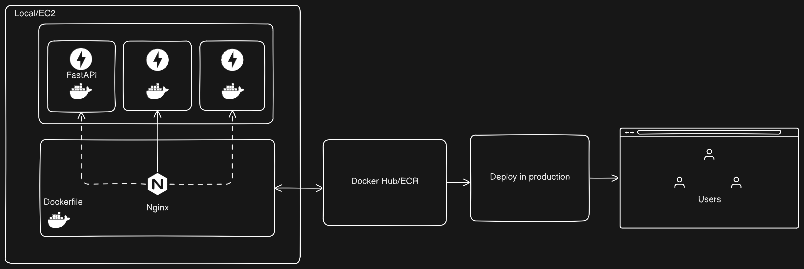

# Scalable Multi-Task Classification API

このAPIは、テキストおよび画像データを分類するための複数の機械学習モデルを使用して、APIとインターフェースを提供します。アプリケーションは、異なる分類タスクを一元的なAPIを通じて効率的に管理し、提供するように設計されています。Nginxをリバースプロキシとして使用し、アプリケーションのスケーラビリティと効率的なリクエスト管理を実現しています。

## 目次
1. [使用するモデルと目的](#使用するモデルと目的)
2. [マルチタスクAPIの構築](#マルチタスクAPIの構築)
3. [アーキテクチャ](#アーキテクチャ)
4. [データバリデーションとAPIテスト](#データバリデーションとAPIテスト)
5. [本番環境へのデプロイ](#本番環境へのデプロイ)
6. [使用するツール](#使用するツール)
7. [DockerとNginxの設定](#dockerとnginxの設定)

## 使用するモデルと目的

### 感情分類モデル
- **目的**: 映画レビューを肯定的または否定的な感情に分類します。

### 災害ツイート分類モデル
- **目的**: ツイートが災害に関するものであるかどうかを判定します。

### 人間のポーズ分類モデル
- **目的**: 画像データから人間の動作（例えば、立っている、座っているなど）を分類します。

これらのモデルは、BERTとその軽量版であるTiny BERTを使用して実装されています。Tiny BERTは、リソース消費を抑えながらも高い精度を保つ効率的なモデルです。全体として、HuggingFaceのツールを用いてモデルを訓練し、モデルとデータをAmazon S3にアップロードし、その後サーバーがS3からデータをダウンロードして提供します。

## マルチタスクAPIの構築

このWebアプリケーションは、複数のモデルを一つのAPIに統合し、ユーザーが異なる分類タスクを単一のインターフェースで利用できるように設計されています。ユーザーは特定のエンドポイントにリクエストを送信することで、感情分類、災害ツイート分類、人間のポーズ分類を行うことができます。

## アーキテクチャ

- **FastAPIとUvicornサーバー**: このアプリケーションは、PythonのFastAPIフレームワークを使用して構築されています。FastAPIは高性能で軽量なWebフレームワークであり、Uvicornサーバーと組み合わせて使用します。
  
- **MLモデルの統合**: FastAPIがリクエストを受け取ると、適切なMLモデルにデータを渡して分類結果を生成し、ユーザーに返します。

## データバリデーションとAPIテスト

- **Pydanticによるバリデーション**: FastAPIでは、Pydanticを使用してデータモデルを定義し、APIに送信されるデータの整合性をチェックします。

- **APIテスト**: POSTMANなどのツールを使用して、APIが期待通りに動作しているかを確認します。

## 本番環境へのデプロイ

- **AWS EC2でのデプロイ**: 構築したモデルとAPIをAWSのEC2サーバーにデプロイし、実際の運用環境で使用できるようにします。

## 使用するツール

- **FastAPI**: 高速で軽量なWebフレームワーク。
- **Uvicorn**: 高速なASGIサーバー。
- **HuggingFace Transformers**: NLPモデルライブラリ。
- **Pydantic**: データバリデーションツール。
- **POSTMAN**: APIテストツール。
- **AWS S3**: クラウドストレージサービス。
- **AWS EC2**: クラウドコンピューティングサービス。
- **Docker**: コンテナ化プラットフォーム。
- **Docker Compose**: 複数のコンテナの定義と実行ツール。
- **Nginx**: リバースプロキシサーバー。

## DockerとNginxの設定

### DockerとDocker Composeの設定

#### Dockerfileの作成

FastAPIアプリケーションのDockerイメージを作成するためのDockerfileを用意します。Dockerfileでは、Python環境の構築、必要なライブラリのインストール、アプリケーションコードのコピー、およびFastAPIの起動コマンドを設定します。

#### Docker Composeファイルの作成

Docker Composeを使って、複数のFastAPIコンテナとNginxコンテナを定義する`docker-compose.yml`ファイルを作成します。これにより、FastAPIアプリケーションのスケーリングとNginxによるリバースプロキシ設定を行います。

#### Nginx設定ファイルの作成

Nginxの設定ファイルを作成し、リバースプロキシの設定を行います。Nginxがリクエストを受け取り、FastAPIコンテナに転送する設定をします。

### サービスの起動とスケーリング

#### Docker Composeの起動

Docker Composeを使ってサービスを起動します。これにより、FastAPIのコンテナとNginxが起動し、リクエストの処理が開始されます。

#### スケーリング

Docker Composeを使用してFastAPIサービスのスケーリングを行います。これにより、複数のFastAPIコンテナが起動し、リクエストが分散されます。

